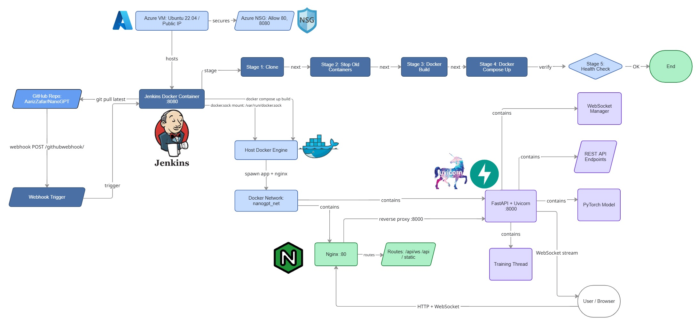

# NanoGPT - Training Studio

A character-level Transformer language model with a production-grade deployment pipeline.
Train GPT-style models on any text dataset through a live web UI runs locally or on the cloud with full CI/CD automation.

---

## What This Is

NanoGPT implements the core Transformer architecture (multi-head self-attention, positional embeddings, feed-forward layers) from scratch in PyTorch. It is served through a FastAPI backend with real-time WebSocket streaming, containerised with Docker, reverse-proxied through Nginx, deployed on an Azure Virtual Machine, and automatically rebuilt and redeployed on every Git push via a Jenkins CI/CD pipeline.

The UI lets you upload any `.txt` corpus, tune hyperparameters, watch the loss curve update live during training, and see the model generate text in real time — all from the browser.

---

## Deployment Diagram



---

## Tech Stack

| Layer | Technology |
|---|---|
| Model | PyTorch Transformer (attention, embeddings, feed-forward) |
| API | FastAPI + Uvicorn (ASGI, async, WebSocket) |
| Reverse Proxy | Nginx (SSL termination, WebSocket upgrade, port routing) |
| Containerisation | Docker + Docker Compose |
| Cloud | **Microsoft Azure** Ubuntu VM, public IP, NSG port rules |
| CI/CD | **Jenkins** pipeline triggered by GitHub webhook on every push |
| Package Manager | uv |
| Frontend | Vanilla JS, Chart.js, WebSocket (single HTML file, no framework) |

---

## CI/CD Pipeline — Azure + Jenkins

Every `git push` to `main` triggers an automated deployment:

```
git push
    → GitHub webhook fires
        → Jenkins (running on Azure VM) receives trigger
            → pulls latest code from GitHub
            → stops old Docker containers
            → rebuilds Docker image
            → spins up new containers (app + nginx)
            → health check passes
                → live on http://<azure-vm-ip>
```

Jenkins runs inside a Docker container on the Azure VM with the host Docker socket mounted — giving it full ability to build and manage containers on the host without any additional agents.

---

## Folder Structure

```
nanogpt/
├── app/
│   ├── api/
│   │   ├── routes.py          # /upload, /train, /generate, /status, WS /ws/loss
│   │   └── websocket.py       # WebSocket connection manager (broadcast to all clients)
│   ├── core/
│   │   ├── embeddings.py      # Token + positional embeddings
│   │   ├── layers.py          # Head, MultiHeadAttention, FeedForward, Block
│   │   ├── model.py           # BigramLanguageModel
│   │   ├── trainer.py         # Training loop with on_eval callback hook
│   │   └── generator.py       # Text generation wrapper
│   ├── schemas/
│   │   └── train_schema.py    # Pydantic request validation
│   ├── utils/
│   │   └── tokenizer.py       # Character-level vocab, encode, decode
│   ├── state.py               # Global in-memory app state
│   └── main.py                # FastAPI app entrypoint
│
├── frontend/
│   └── index.html             # Single-file UI (Chart.js, WebSocket, hyperparameter form)
│
├── training_data_corpus/      # Default datasets (Shakespeare, Rich Dad Poor Dad, Law of Human Nature)
│
├── nginx/
│   └── nginx.conf             # Reverse proxy config (WebSocket upgrade, API routing)
│
├── Dockerfile                 # Python 3.11-slim, uv install, uvicorn entrypoint
├── docker-compose.yml         # app + nginx services on a shared bridge network
├── Jenkinsfile                # Declarative pipeline (clone → stop → build → health check)
└── pyproject.toml             # uv-managed dependencies
```

---

## Running Locally

**Without Docker:**
```bash
uv pip install -r pyproject.toml
uvicorn app.main:app --host 0.0.0.0 --port 8000 --reload
```
Open `http://localhost:8000`

**With Docker (full stack — app + nginx):**
```bash
docker compose up --build -d
```
Open `http://localhost`

## How It Works

1. Upload a `.txt` file (or pick a default dataset)
2. Set hyperparameters — block size, embedding dim, heads, layers, learning rate
3. Click **Start Training**
4. Watch the loss graph update live via WebSocket every eval interval
5. Generated text appears on screen as the model learns

The training loop runs in a background thread. Every N steps it pushes `{epoch, train_loss, val_loss}` and a sample of generated text over WebSocket to all connected browser clients.

## Running the Application locally

### Start (detached — terminal can be closed)
```bash
docker compose up --build -d
```

### View logs / print statements separate terminal
```bash
docker compose logs -f app
```
`-f` follows live logs. Press `Ctrl+C` to exit - the container keeps running.

### View nginx logs
```bash
docker compose logs nginx
```

### Stop the container (keeps images)
```bash
docker compose stop
```

### Start again (no rebuild)
```bash
docker compose start
```

### Delete this project's containers, images, and network
```bash
docker compose down --rmi local
```

### Run locally (without Docker)
```bash
uvicorn app.main:app --host 0.0.0.0 --port 8000 --reload
```

### Access the app
Open [http://localhost/](http://localhost/) in your web browser.

### Rebuilding
If you need to rebuild after making changes:
```bash
docker compose down
docker compose up --build -d
```

---

### Command reference

| Command | Effect |
|---|---|
| `down` | Stops and removes containers and network. Images stay on disk. |
| `down --rmi local` | Same as above, plus removes images built from this project's Dockerfile only. Frees disk space, but the next `up --build` will download/build everything again. Other Docker images are left untouched. |